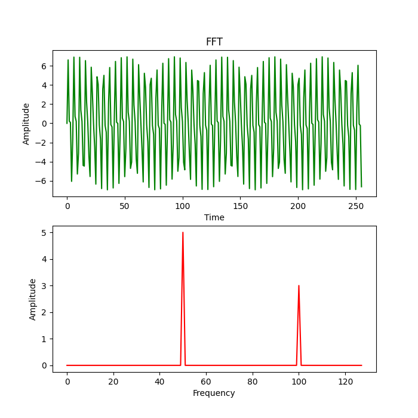

# Thông tin trình biên dịch trên Windows10:
gcc version 8.1.0 (x86_64-posix-seh-rev0, Built by MinGW-W64 project)

# Hướng dẫn thực thi:

- B1: biên dịch file 'FFT.c' thành file 'FFT'(bắt buộc tên này) với lệnh: `gcc FFT.c -o FFT -lm`
- B2: chạy file 'Display_Signal.py' sau khi đã cài các module 'numpy',
 'matplotlib', 'subprocess' để trực quan hóa kết quả.

